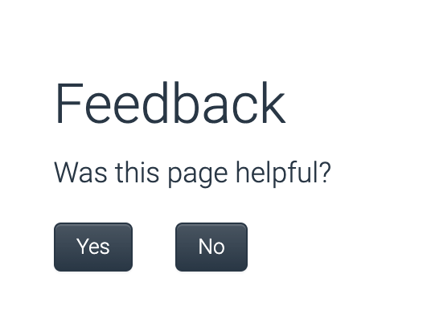

# Hackathon 2023

Our team name is Slackers.

Our project's goal was to create a Slack Channel that will be automatically populated every week with Google Analytics insights about the [Documentation website](docs.sysdig.com).

The metrics we have prioritised are the following:

1. Page Views
2. Top Pages
3. Average Time on Page
4. Bounce Rate
5. New Visitor Sessions
6. Returning Visitor Sessions
7. Exit Rate
8. Top Exit Pages

Some other metrics I think would be useful:
- Top landing pages
- Top sources for new users
- How many 'Yes' or 'No' responses each page gets for 'Was this page helpful?'
- Most common search queries

 

 ## Why is this Important?

Analytics allow us to understand how our site is being used, for example, which pages are most read, how users navigate between pages, and in what format are they reading the site. This knowledge can inform our efforts, and maximise the impact of the work we do. We might prioritise revisions on the most popular pages, for example. And we might re-think how we structure our sections based on observations of user behaviour. 

 ## What we Did

 We looked at an existing Slack app, [Google Analytics Insights](https://sysdigcloud.slack.com/apps/AA42VQN5U-google-analytics-insights). This app has free features, as well as a paid plan. The free version is limited, and the paid plan is prohibitively expensive, at $2148 per annum. We chose to create our own app, offering equivalents to the paid features in Google Analytics Insights.

 Google Analytics provides information, but not all information is created equal. There is no sense in bombarding the Docs team with information that doesn't help or guide their efforts. An example might be site traffic. The Docs team is not running a marketing campaign, so telling them the site traffic increased by 5% doesn't make a meaningful difference to their work. On the other hand, telling them that 90% of readers bounce off a certain page is useful.
 
Another consideration is the timeliness of the information. There is no sense to receiving weekly reports if the information does not change week by week. Fixed stats, such as the ten most popular pages, are helpful to know, but only consume space when re-iterated in a weekly report. The data we communicate in the reports should be timely, relevant, and actionable.

 
